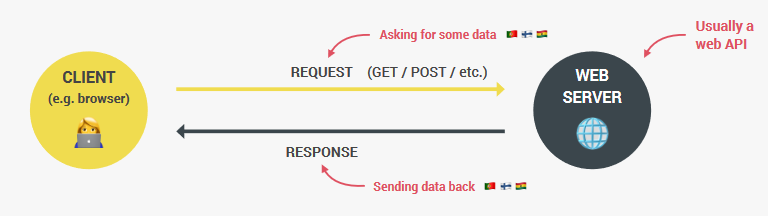

### [THE COMPLETE JAVASCRIPT COURSE - JONAS SCHMEDTMANN](https://www.udemy.com/course/the-complete-javascript-course)

- ASYNCHRONOUS JAVASCRIPT, AJAX AND APIS

<details>
<summary> 1. Synchronous Code </summary>
<br>
Synchronous Code: Code that is executed line by line in the order that it appears. Each line of code waits for the previous line to finish executing before it is executed. This is the default behavior of JavaScript. Most of the code we have written so far is synchronous code. It has a disadvantage ie Long-running operations block code execution which means that it has to wait for long codes to keep finish running before the next line is executed.
  <br>

```Javascript
// Synchronous Code
    const p = document.querySelector('.p');
    p.textContent = 'I am Josh!';
    alert('Text set!');
    p.style.color = 'red';
```

The `alert` is a example of the long-running operation. It blocks the code execution until the user `clicks` the OK button. This is a problem because the user cannot do anything else on the page until the `alert` is closed.<br>
This maybe fine but in cases for example where execution has to wait for a 5 second timer to finish running before the next line of code is executed, it becomes a problem. <br>

</details>

<details>
<summary> 2. Asynchronous Code Intros</summary>
<br>
Asynchronous Code: Code that is  executed line by line in the order that it appears. Each line of code does not wait for the previous line to finish executing before it is executed. <br>

```Javascript
// Asynchronous Code
    const p = document.querySelector('.p'); // The first line is still synchronous and we move on to the next line
    setTimeout(() => { // Here we encounter the Timeout function which will basically starts a timer in an asynchronous way. So this means that the timer will essentially run in the background without affecting the main code. We also register a callback function which will be called as soon as the timer is finished. This callback function will be called by the web API and not by the main code.
      p.textContent = 'I am Josh!';
    }, 5000); // The main code is not been blocked by the timer. It continues to run and the next line of code is executed. This is called non-blocking code.
    p.style.color = 'red';
```

Asynchronous programming is about coordinating the behaviour of a program over a period of time.<br>
As seen in the example we need a callback function to execute an asynchronous code. But that does not mean that callback functions automatically make code asynchronous.

```Javascript
[1,2,3].map(v=>v*2); // This accepts a callback function but it is still synchronous
```

Only certain functions are asynchronous like `setTimeout` and we just have to know which ones are and aren't<br>
N.B: Callback functions alone do _NOT_ make code asynchronous!

</details>

<details>
<summary> 3. Asynchronous Code Examples </summary>
<br>

```Javascript
const img = document.querySelector('.dog-img'); // This is a synchronous code
img.src = 'dog.jpg';  // This is a synchronous code - But, here we set the src attribute of any image is asynchronous as it is set in the background by the browser. The browser will download the image in the background and then set the src attribute. This is an asynchronous code.
img.addEventListener('load', function() { // Listening for the load event which is fired as soon as the image is loaded. This is an asynchronous code. As all this code is 'non-blocking' and will run in the background without affecting the main code.
  img.classList.add('fadeIn');
});
// Since we are listening once it is ready it joins the event loop and waits for the event to happen. Once the event happens the callback function is called and the code is executed.
p.style.width = '500px';
```

N.B: `addEventListener` does _NOT_ automatically make code asynchronous! for example:
<br>

```Javascript
const img = document.querySelector('.dog-img');
img.addEventListener('click', function() {
  img.classList.add('fadeIn');
});
```

<br>
This is a synchronous code because the callback function is only called when the user `clicks` on the image. So the callback function is only called when the event happens. This is not asynchronous code because the code is not running in the background. It is only running when the event happens. It is simply waiting for an `event` to happen but it is not doing anything.

Now what makes the first example asychronous is simply the fact that the image is loaded asychronously in the background and not because we are listening for the `load` event. So the code is running in the background and it is not blocking the main code.

Other examples of asynchronous code include: `Geolocation API`, `AJAX` (This is probably the most important usecase of asynchronous `JavaScript`)

More examples from my personal research includes - `Fetch API`, `Web Workers`, `IndexedDB`, `File API`, `Application Cache`, `Web Sockets`, `Server-Sent Events`, `Service Workers`, `Promises`, `Async/Await` etc.
<br>

</details>

<details>
<summary> 4. What are AJAX calls and APIs </summary>
<br>

AJAX: Asynchronous `JavaScript` And XML. Allows us to communicate with remote web servers in an asynchronous way. This means that we can request data from web servers dynamically and then use that data to update the page without reloading the page. <br>

Say we have a client and we want to get some data from the server. We can do this by sending a request to the server. The server will then process the request and send back a response containing the data we requested. This happens asynchronously in the backgroung in a `request-response cycle`.
There can even be different types of request `GET` request to recieve data, `POST` request to send data, `PUT` request to update data, `DELETE` request to delete data etc. <br>

This server usually contains a `WEB API` which contains the data we are looking for.
<br>



<br>

API: Application Programming Interface. A piece of software that can be used by another piece of software, in order to basically allow applications to talk to each other. And this is true not just for `JavaScript` or Web development but for programming in general.

In `JavaScript` and web development, there are various types of APIs available, such as the `DOM API` and `Geolocation API`. APIs are self-contained software components that enable interaction with other software. One way to create a simple API is by implementing it in a class, where certain methods are made accessible as a public interface. Objects created from a class act as encapsulated software components that can be interacted with by other software.

The primary API discussed here is the Online API, which refers to an application running on a web server. It receives data requests, retrieves the requested data from a database, and sends it back to the client. These online APIs are commonly referred to as APIs, Web APIs, or simply API, as the term Web API is used for various other purposes as well.

Building an Online API involves back-end development, which includes working with servers, databases, and utilizing `Node.js`. This course focuses on using third-party APIs that are often available for free.

There is an API for everything for instance When developing applications like a travel app, APIs are essential for obtaining weather data, information about destination countries, flight details, currency conversion, and even functionalities like sending emails, text messages, or embedding Google Maps. APIs have played a significant role in shaping the modern web, and their usage is popular in `JavaScript`.

Regarding API data formats, the term AJAX originally stood for Asynchronous `JavaScript` and XML. XML used to be widely used for data transmission on the web, but currently, APIs no longer use XML. However, the term AJAX is still used, even though JSON (`JavaScript` Object Notation) has become the most popular data format. JSON is essentially a `JavaScript` object converted to a string, which makes it easy to send across the web and use in `JavaScript` once the data is received.
<br>

</details>

<details>
<summary> 5. How to make AJAX calls (Setup)</summary>
<br>

[API of Countries](https://countries-api-836d.onrender.com/countries/)

Here we are make a card UI component that comes from a Online API. We are going to use the `fetch` API to make AJAX calls.

The Starter Code is as follows:

```HTML
<!DOCTYPE html>
<html lang="en">
  <head>
    <meta charset="UTF-8" />
    <meta name="viewport" content="width=device-width, initial-scale=1.0" />
    <meta http-equiv="X-UA-Compatible" content="ie=edge" />
    <link rel="stylesheet" href="style.css" />
    <script defer src="script.js"></script>
    <title>Asynchronous JavaScript</title>
  </head>
  <body>
    <main class="container">
      <div class="countries">
        <!--
        <article class="country">
          
          <div class="country__data">
            <h3 class="country__name">COUNTRY</h3>
            <h4 class="country__region">REGION</h4>
            <p class="country__row"><span>👫</span>POP people</p>
            <p class="country__row"><span>🗣️</span>LANG</p>
            <p class="country__row"><span>💰</span>CUR</p>
          </div>
        </article>
        -->
      </div>
      <!-- <button class="btn-country">Where am I?</button> -->
      <div class="images"></div>
    </main>
  </body>
</html>
```

```CSS
* {
  margin: 0;
  padding: 0;
  box-sizing: inherit;
}

html {
  font-size: 62.5%;
  box-sizing: border-box;
}

body {
  font-family: system-ui;
  color: #555;
  background-color: #f7f7f7;
  min-height: 100vh;

  display: flex;
  align-items: center;
  justify-content: center;
}

.container {
  display: flex;
  flex-flow: column;
  align-items: center;
}

.countries {
  /* margin-bottom: 8rem; */
  display: flex;

  font-size: 2rem;
  opacity: 0;
  transition: opacity 1s;
}

.country {
  background-color: #fff;
  box-shadow: 0 2rem 5rem 1rem rgba(0, 0, 0, 0.1);
  font-size: 1.8rem;
  width: 30rem;
  border-radius: 0.7rem;
  margin: 0 3rem;
  /* overflow: hidden; */
}

.neighbour::before {
  content: 'Neighbour country';
  width: 100%;
  position: absolute;
  top: -4rem;

  text-align: center;
  font-size: 1.8rem;
  font-weight: 600;
  text-transform: uppercase;
  color: #888;
}

.neighbour {
  transform: scale(0.8) translateY(1rem);
  margin-left: 0;
}

.country__img {
  width: 30rem;
  height: 17rem;
  object-fit: cover;
  background-color: #eee;
  border-top-left-radius: 0.7rem;
  border-top-right-radius: 0.7rem;
}

.country__data {
  padding: 2.5rem 3.75rem 3rem 3.75rem;
}

.country__name {
  font-size: 2.7rem;
  margin-bottom: 0.7rem;
}

.country__region {
  font-size: 1.4rem;
  margin-bottom: 2.5rem;
  text-transform: uppercase;
  color: #888;
}

.country__row:not(:last-child) {
  margin-bottom: 1rem;
}

.country__row span {
  display: inline-block;
  margin-right: 2rem;
  font-size: 2.4rem;
}

.btn-country {
  border: none;
  font-size: 2rem;
  padding: 2rem 5rem;
  border-radius: 0.7rem;
  color: white;
  background-color: orangered;
  cursor: pointer;
}

.images {
  display: flex;
}

.images img {
  display: block;
  width: 80rem;
  margin: 4rem;
}

.images img.parallel {
  width: 40rem;
  margin: 2rem;
  border: 3rem solid white;
  box-shadow: 0 2rem 5rem 1rem rgba(0, 0, 0, 0.1);
}
```

and the `script.js` file is as follows:

```Javascript
'use strict';

const btn = document.querySelector('.btn-country');
const countriesContainer = document.querySelector('.countries');
```

</details>

<details>
<summary> 6. How to make AJAX calls (XMLHttpRequest)</summary>
<br>

So now we focus on the `script.js` file. We are going to use the `fetch` API to make AJAX calls. There are multiple ways to make AJAX calls, but start with the old school way the `XMLHttpRequest` function.

This is a link to all [Public APIs](https://github.com/public-apis/public-apis) that you can use to practice with.

We need to check fo CORS ( Cross Origin Resource Sharing). As we cannot access the data from the API without it. It should be YES or Unknown. If it is NO then we cannot access the data.

```Javascript
'use strict';

const btn = document.querySelector('.btn-country');
const countriesContainer = document.querySelector('.countries');

///////////////////////////////////////

const  request = new XMLHttpRequest(); // We call first and store in variables. The is how AJAX calls used to be handled with events and callbacks. Modern way is with Promises and the Fetch API.

// + Next we need the url to do the AJAX Call
// + We get the REST COUNTRIES API from the Public APIs linked above.

// This is the API we are using. We are using the GET method and the url.
request.open('GET', 'https://restcountries.com/v3.1/name/nigeria'); //With this we basically open the request. We need to pass in the HTTP method and the url.

// We cannot just store the value in a variable. We need to listen for the load event. like this  - data = request.send(); We send the request. The AJAX call is asynchronous. So we need to wait for the data to load. We need to listen for the load event.

request.send(); // This is the method that actually sends the request.

// We need to listen for the load event.
request.addEventListener('load', function () {
  console.log(this.responseText); // The THIS keyword here is the request which means that we can replace it with request.responseText. This is the data we get back from the API.

// At this point the Console looks like this: [{"name":{"common":"Nigeria","official":"Federal Republic of Nigeria","nativeName":{"eng":{"official":"Federal Republic of Nigeria","common":"Nigeria"}}},"tld":[".ng"],"cca2":"NG","ccn3"...] - My first AJAX call 😍nand it workssssss.

//It is a JSON string. We need to convert it to an object. We can do this with the JSON.parse() method.
const [data] = JSON.parse(this.responseText); // We use array destructuring to get the first element of the array. We use the JSON.parse() method to convert the JSON string to an object. 
console.log(data); // This is the data we get back from the API. It is an object.
});

```
we at this point we have the data from the API. We can now use it to display the data on the page. so we get the commented article part from the index.html file and add it to the script.js file using template literals. 

```Javascript
'use strict';

const btn = document.querySelector('.btn-country');
const countriesContainer = document.querySelector('.countries');

///////////////////////////////////////

const request = new XMLHttpRequest();
request.open('GET', 'https://restcountries.com/v3.1/name/nigeria');
request.send();

request.addEventListener('load', function () {
  const [data] = JSON.parse(this.responseText);
  console.log(data);

// We just replace the data from what we get from the API object already now visible in the console. So for population in the console it is in millions so we divide by a million (the underscore is a convention we learnt from earlier chapters) and then we fix to one decimal place. We also add the flag image from the API. We also add the region and the name. We also add the language and the currency.
  const html= `
         <article class="country">
          
          <div class="country__data">
            <h3 class="country__name">${data.name}</h3>
            <h4 class="country__region">${data.region}</h4>
            <p class="country__row"><span>👫</span>${(+data.population / 1_000_000).toFixed(1)} million people</p> 
            <p class="country__row"><span>🗣️</span>LANG</p>
            <p class="country__row"><span>💰</span>CUR</p>
          </div>
        </article>
  `
});

```


